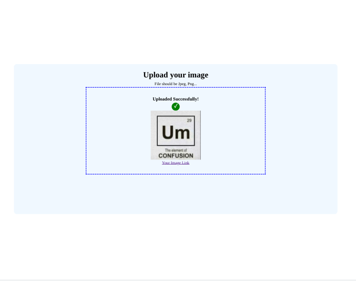

<h1 align="center">Image Uploader</h1>

<div align="center">
   Solution for a challenge from  <a href="https://legacy.devchallenges.io/challenges/O2iGT9yBd6xZBrOcVirx" target="_blank">Devchallenges.io</a>.
</div>

## Table of Contents

- [Overview](#overview)
  - [Built With](#built-with)
- [How To Use](#how-to-use)
- [Features](#features)
- [Requirements](#requirements)
- [Useful Resources](#useful-resources)

## Overview




- This uses a signed signature. 

- You have to use NEXT_PUBLIC otherwise env variables will be undefined.
- Make sure to build so env variables are loaded.

- Next JS really helps for signing the upload as it protects your secret and saves you from coding an express server.  
- [Cloudinary](https://github.com/cloudinary-devs/cld-signed-upload-examples) has an example where a whole express server is required.

- I limited it to single file uploads - to render multiple uploads have to do extra looping when uploading & rendering the image / link. 

- target _blank now includes noopener by default but nextjs warns you without rel="noreferrer" (which includes noopener) 

- need performance optimizations to lower first page load (133kb).  CSS file seems large for limited css here.  The CSS in the components may be expensive.  

- You have to refresh after uploading an image.

- If you upload an svg, the public cloudinary link will prompt you to download the file to see it.

- if you drop an image, the button's 'no file chosen' will still display.  However, the file is saved and can be uploaded.   
- I decided to remove it with conditional rendering.  Set title attribute of file input to uploadedFile state value? 

- You have to manually add a language attribute to a next js project.  [See Github](https://github.com/vercel/next.js/issues/9160) for more about this.  I find this a little bizarre and something that I guarantee users of create-next-app take for granted.

### Built With

- [Next](https://nextjs.org)
- [Cloudinary](https://cloudinary.com)
- [React DND](https://react-dnd.github.io/react-dnd/about)

## How To Use

To clone and run this application, you'll need [Git](https://git-scm.com) and [Node.js](https://nodejs.org/en/download/) (which comes with [npm](http://npmjs.com)) installed on your computer. From your command line:

```bash
# Clone this repository
$ git clone https://github.com/jdegand/image-uploader

# Install dependencies
$ npm install

# Add env variables from cloudinary

# Run the app
$ npm run build
$ npm run start
```

## Features

This application/site was created as a submission to a [DevChallenges](https://devchallenges.io/challenges) challenge. The [challenge](https://legacy.devchallenges.io/challenges/O2iGT9yBd6xZBrOcVirx) was to build an application to complete the given user stories.

## Requirements

- [x]  I can drag and drop an image to upload it
- [x]  I can choose to select an image from my folder
- [ ]  I can see a loader when uploading
- [x]  When the image is uploaded, I can see the image and copy it
- [ ]  I can choose to copy to the clipboard

## Useful Resources

- [Steps to replicate a design with only HTML and CSS](https://devchallenges-blogs.web.app/how-to-replicate-design/)
- [Dev.to](https://dev.to/es404020/file-upload-in-next-js-12i6) - file upload
- [YouTube](https://www.youtube.com/watch?v=V8w7K1HdrFo) - Tutorial
- [ReactGo](https://reactgo.com/nextjs-change-favicon/) - change favicon in nextjs
- [CodeSandbox](https://codesandbox.io/s/github/react-dnd/react-dnd/tree/gh-pages/examples_js/06-other/native-files?from-embed=&file=/src/TargetBox.jsx) - react dnd file drop example
- [YouTube](https://www.youtube.com/watch?v=7lhUsK-FxYI) - Colby Fayock Image Uploader Tutorial
- [YouTube](https://www.youtube.com/watch?v=TBOkDQEBPIU) - React DropZone Image Uploader with multiple files
- [YouTube](https://www.youtube.com/watch?v=MAw0lQKqjRA) - React Uploader with Drag and Drop
- [Stack Overflow](https://stackoverflow.com/questions/7752188/formdata-appendkey-value-is-not-working) - can't see what's inside FormData?
- [W3 Schools](https://www.w3schools.com/howto/howto_js_copy_clipboard.asp) - copy to clipboard
- [Stack Overflow](https://stackoverflow.com/questions/39501289/in-reactjs-how-to-copy-text-to-clipboard) - react copy to clipboard
- [Github](https://github.com/cloudinary/cloudinary_js/issues/143) - 400 bad request
- [Unicode Table](https://unicode-table.com/en/2713/) - checkmark
- [Stack Overflow](https://stackoverflow.com/questions/50709625/link-with-target-blank-and-rel-noopener-noreferrer-still-vulnerable) - _blank
- [Blog](https://melvingeorge.me/blog/set-html-lang-attribute-in-nextjs) - set html lang attribute in nextjs
- [A11y Project](https://www.a11yproject.com/posts/how-to-hide-content/) - how to hide content
- [Stack Overflow](https://stackoverflow.com/questions/5138719/change-default-text-in-input-type-file) - file input styling
- [Stack Overflow](https://stackoverflow.com/questions/12035400/how-can-i-remove-the-no-file-chosen-tooltip-from-a-file-input-in-chrome) - title attribute of file input
